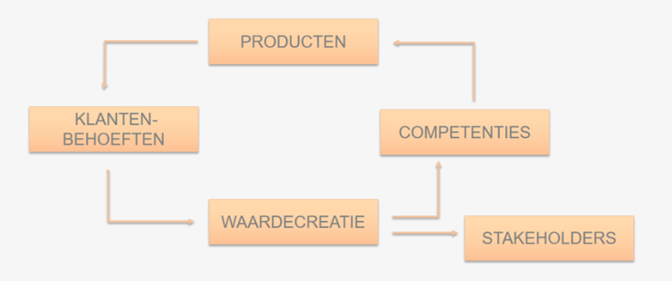
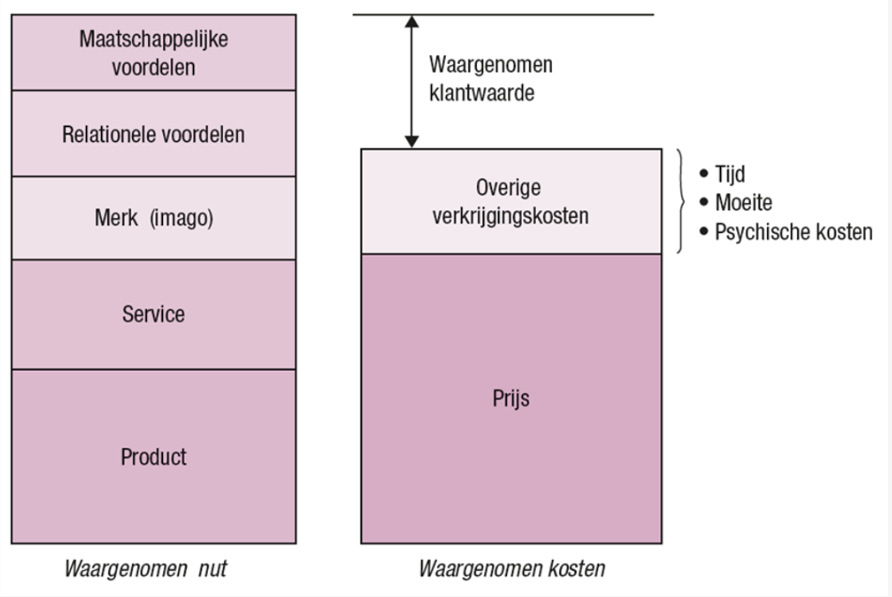
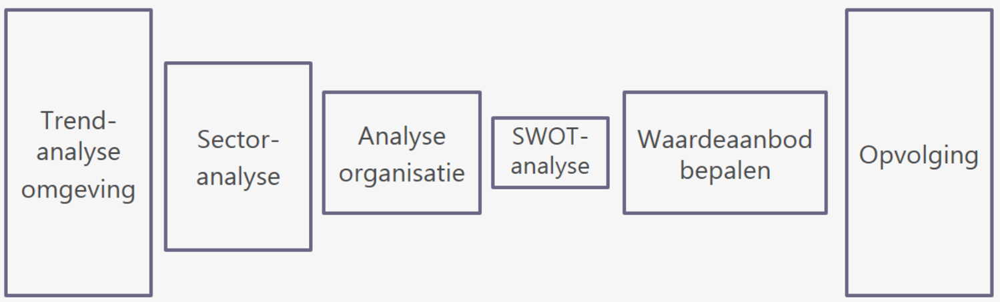

# Deel 1: Continuïteit en waardecreatie <!-- omit in toc -->

- [Business](#business)
  - [De continuïteitskring](#de-continuïteitskring)
  - [Waardecreatie](#waardecreatie)
- [Management](#management)
  - [Management activiteiten](#management-activiteiten)
  - [Managementprocessen](#managementprocessen)
  - [Voordelen](#voordelen)
  - [PDCA-cyclus](#pdca-cyclus)

---

## Business

### De continuïteitskring

Een organisatie die wilt voorgestaan streeft naar continuïteit.

- **Producten:** Goederen of dienstaten laten de organisatie toe te beantwoorden aan klantenbehoeften en klantenwensen.
- image.png kopen producten omdat ze een tekort ervaren
- **Waardecreatie:** Wanneer de producten worden verkocht ontstaat er waarde voor de organisatie onder de vorm van omzet, winst, cash flow, ...
- **Competenties:** Bedrijfsopbrengsten investeren in kennis en middelend om nieuwe producten te ontwikkelen.
- **Stakeholders:** Bedrijfsopbrengsten uitkeren aan belanghebbenden: aandeelhouders, medewerkers, belangengroepen, ...

### Waardecreatie

Waardecreatie gebeurt als er 3 voorwaarden vervuld zijn. Deze 3 elementen vormen de basis voor goede marketing.

- **Klantenbehoeften ontdekken** :arrow_forward: Klant ervaart behoeftebevrediging? Hoe voorzien we behoeften van klanten?
- **Klantwaarde creëerden** :arrow_forward: Bron van klantenwaarde 
  - Baten = Waargenomen nut
  - Kosten = Waargenomen kosten
- **Belofte nakomen** :arrow_forward: Perceptie van het aangeboden product creëert verwachtingen; Wanneer de verwachtingen worden ingelost ervaart de klant behoeftebevrediging.

---

## Management

Management is de manier waarop een zaak wordt geleid om de continuïteit te kunne realiseren.

### Management activiteiten

- **Plannen:** of doelen voor de toekomst vaststellen.
- **Organiseren:** of structuren van activiteiten om de doelen te realiseren.
- **Leiden:** of begeleiden en motiveren van ondergeschikten.
- **Beheersen:** of controleren of de gestelde doelen en plannen ook worden gehaald.

### Managementprocessen

- Deel 2: [Trendanalyse omgeving](./Part2.md)
- Deel 3: [Sectoranalyse](./Part3.md)
- Deel 4: [Analyse Organisatie](./Part4.md)
- Deel 5: [SWOT-analyse](./Part5.md)
- Deel 6: [Waardeaanbod bepalen](./Part6.md)
- Deel 7: [Opvolging](./Part7.md)

### Voordelen

- Effectiviteit
- Efficiëntie
- Succes

### PDCA-cyclus

- **Plan:** Het probleem beschrijven en acties plannen om verbeteringen aan te brengen.
- **Do:** Het plan uitvoeren.
- **Check:** Nagaan of alles volgens plan is verlopen.
- **Act:** Waar nodig de planning bijsturen.
