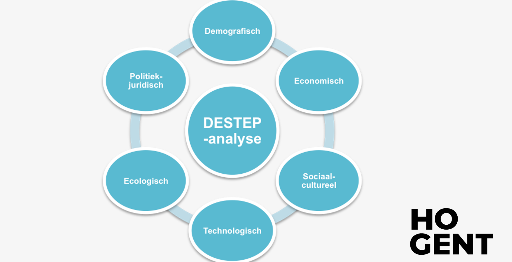
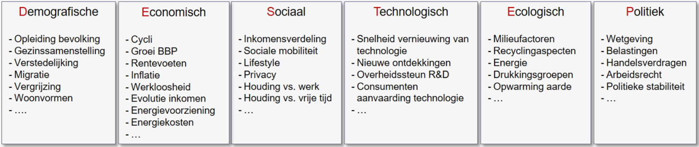
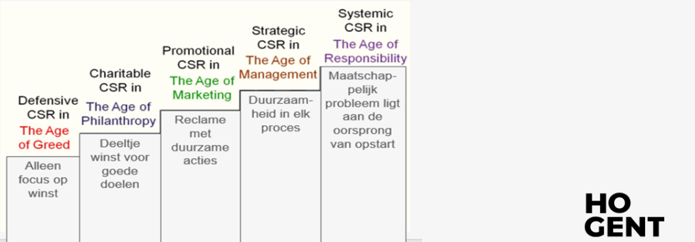
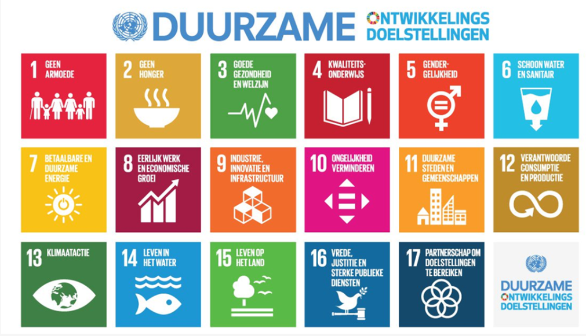
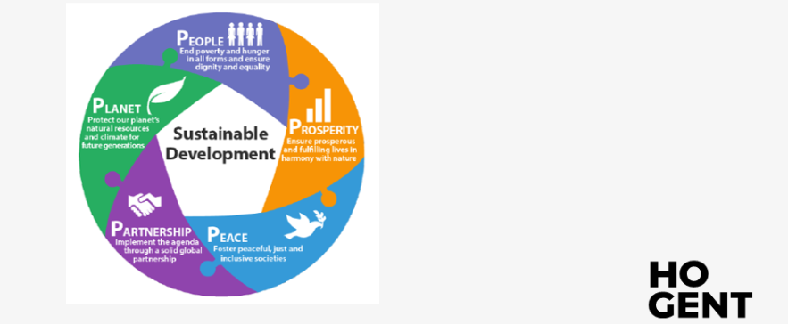

# Deel 2: Trendanalyse omgeving <!-- omit in toc -->

- [Omschrijving](#omschrijving)
  - [Kansen](#kansen)
  - [Bedreigingen](#bedreigingen)
  - [Kans op bedreiging](#kans-op-bedreiging)
- [DESTEP-model](#destep-model)
  - [Omgevingsfactoren](#omgevingsfactoren)
- [Maatschappelijk Verantwoord Ondernemen](#maatschappelijk-verantwoord-ondernemen)
  - [MVO](#mvo)
  - [Maturiteitsniveaus MVO](#maturiteitsniveaus-mvo)
  - [CSR 1.0](#csr-10)
  - [CSR 2.0](#csr-20)
  - [Sociaal ondernemerschap](#sociaal-ondernemerschap)
- [Duurzame ontwikkelingsdoelen VN](#duurzame-ontwikkelingsdoelen-vn)

---

## Omschrijving

De omgeving verander constant en vaak in een snel tempo. Deze veranderingen brengen meestal kansen of bedreigingen voort.

Trendanalyse speelt zich af in de externe omgeving. Externe krachten of spelers beïnvloeden de werking van de organisatie.

### Kansen

Externe ontwikkelingen met eventuele gunstige invloed op de realisatie van doelspellingogen.

Deze zijn gunstig wanneer ze de realisaties van doelstellingen:

- **Ondersteunen**
- **Versnellen**

### Bedreigingen

Externe ontwikkelingen met eventuele remmende invloed op de realisatie van doelstellingen.

De externe ontwikkelingen kunnen ongunstig zijn wanneer ze de realisatie van doelstellingen:

- **Vertragen**
- **Tegenwerken**

### Kans op bedreiging

Pas wanneer er strategische gevolgen worden geïdentificeerd, is er sprake van een kans of bedreiging en zal men hierop moeten inspelen:

- de kans benutten
- de bedreiging neutraliseren

---

## DESTEP-model

Het DESTEP-model wordt gebruikt om de macro-omgeving te analyseren. Hierbij gaat het dus om maatschappelijke, soms internationale ontwikkelingen in verspillende domeinen.

### Omgevingsfactoren

- **Demografische:** Beschrijving van de bevolking naar; grootte, dichtheid, plaats, leeftijd, geslacht, ras, bezigheid, etc...
- **Economische:** De factoren die de **koopkracht** en het **uitgavenpatroon** van de consument beïnvloeden.
- **Sociaal-culturele:** De sociale context; elementaire waarden, perceptie, voorkeuren en het gedrag binnen een maatschappij.
- **Technologische:** Krachten die leiden tot nieuwe technologieën en zo nieuwe kansen creëren voor producten en markten.
- **Ecologische:** Ecologische impact zoals; groeiend tekort in grondstoffen en natuurlijke bronnen, milieuvervuiling en klimaatverandering.
- **Politiek-juridische:** Wetten en overheden die organisaties en individuen in een maatschappij beïnvloeden en beperken.

---

## Maatschappelijk Verantwoord Ondernemen

### MVO

MVO houdt in dat organisaties aandacht hebben voor mensenrechten, consumentenbelangen en sociale, ethische en milieukwesties.

### Maturiteitsniveaus MVO

MVO is tijdens de vorrbije jaren geleidelijk aan veranderd. Zowel op het vlak van invulling als op het vlak van maatschappelijke bewustwording:

1. Wetenschappers
2. politici, bedrijven
3. mensen in het algemeen

**Met MVO of CSR** (Corporate Social Responsibility) worden verschillende commerciële sectoren ingedeeld.

**Greenwashing:** doen alsof een bedrijf groener of maatschappelijk verantwoorder is dan dat het eigenlijk is.

### CSR 1.0

Defensive CSR, Charitable CSR, Promotional CSR and Strategic CSR behoren tot CSR 1.0.
De normale aanpak bestaat eruit om zoveel mogelijk producten te produceren die, na verloop van tijd, door nieuwe worden vervangen. Hierbij wordt er steeds nieuwe grondstof gebruikt en verdwijnt het oude product op de afvalberg.
**Downcycling:** Hergebruik van materiaal, maar zorgt voor minderwaardig product van lager kwaliteit, dat alsnog (sneller) op de afvalberg geraakt.

### CSR 2.0

Systemic CSR in **the age of responsibility**. Niveau 5; Maatschappelijke uitdagingen als kans. Dit creëert meer Economische waarde en heeft een positieve impact.

### Sociaal ondernemerschap

Een maatschappelijk probleem ligt aan de oorsprong voor de opstart van de onderneming. De missie of bestaansreden van de organisatie wordt door MVO geïnspireerd.

Een sociaal ondernemer moet:

- zicht hebben op de maatschappelijke uitdaging en oplossing
- beseffen dat samenwerking noodzakelijk is om vooruit te geraken
- er in slagen om een verdienmodel op te zetten waar iedereen (en dus ook de ondernemer) wel bij vaart.

Bij sociaal ondernemerschap wordt de klant meestal **gebruiker** van het product en niet meer de eigenaar.

---

## Duurzame ontwikkelingsdoelen VN

De VN richten 17 Sustainable Development Goals (SDGs) op, deze duurzame ontwikkelingsdoelen zullen tot 2030 de wereldwijde duurzaamheidsagenda bepalen.

Steeds meer organisaties integreren deze ontwikkelingsdoelen in hun dagelijks beleid.
HoGent duurzaamheidcoordinator werken samen met CIFAL (trainingscenter van de VN)
