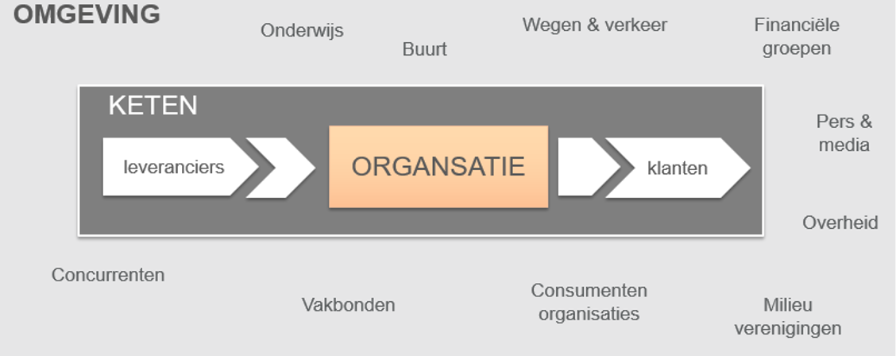
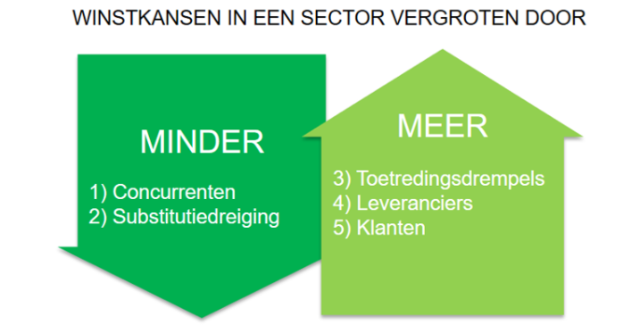
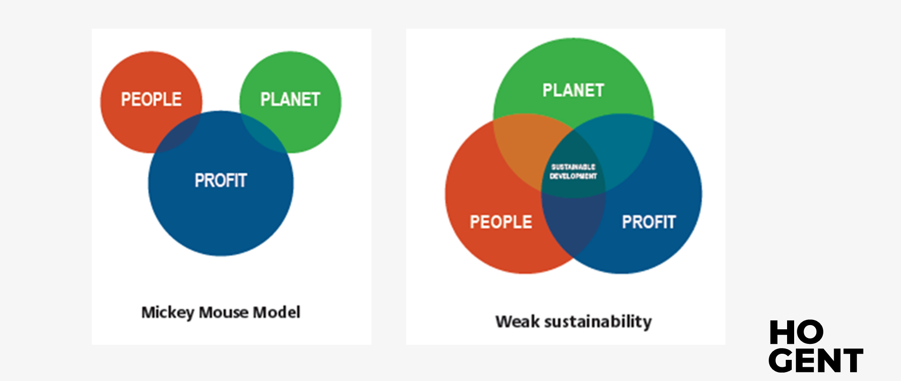
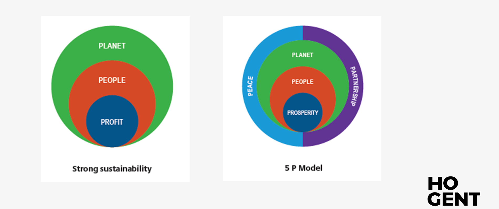

# Deel 3: Sectoranalyse  <!-- omit in toc -->

- [Meso-omgeving](#meso-omgeving)
- [Stakeholders](#stakeholders)
- [Klanten](#klanten)
- [Leveranciers](#leveranciers)
- [Concurrenten](#concurrenten)
  - [Soorten concurrenten](#soorten-concurrenten)
  - [Substitutie](#substitutie)
  - [Vijf-krachten-model Porter](#vijf-krachten-model-porter)
- [Triple bottom-line](#triple-bottom-line)

---

## Meso-omgeving

De meso-omgevingsactoren zijn **niet beheersbaar** maar vaak wel beïnvloedbaar. Daarom moet de organisatie een goed netwerk opbouwen en contacten onderhouden.

---

## Stakeholders

Stakeholders zijn alle belanghebbenden in de omgeving van de onderneming, ze ondervinden de gevolgen van de beslissingen en acties van de organisatie. Daarom verwachten ze **open communicatie**

- **Financiele groepen:** Banken, investeerders en crowdfunding-platformen.
- **Overheid:**
  - Verschillende niveaus: federaal, gewesten, provincies, gemeenten, etc...
  - Ministeries, departementen, agentschappen, adviesraden, ombudsdiensten, etc...
- **Pers, media:**
  - Kranten, radio, televisie, etc...
  - Websites, e-mail, sociale media, YouTube, etc...
- **Maatschappij:** Op allerlei manieren kan vanuit een maatschappelijk belang invloed op organisaties worden uitgeoefend. Vaak treden belangenorganisaties op om namens groeperingen (werknemersorganisaties, consumentenorganisaties en actiegroepen) belangen te verdedigen.

---

## Klanten

Organisaties ontlenen hun bestaansrecht aan het invullen van de behoeften van klanten.

---

## Leveranciers

Relaties met leveranciers onderhouden geeft voordeel bij:

- Prijs
- Kwaliteit
- Beschikbaarheid; leveringstermijnen
- MVO

---

## Concurrenten

Concurrenten bieden producten op dezelfde markt aan. Het waardeaanbod is dan voor dezelfde klanten.

### Soorten concurrenten

Concurrentieniveau is afhankelijk van de gekozen marktafbakening:

- **Product- of merkconcurrentie (specifiek):** Andere bedrijven die een soortgelijke product of service aanbieden tegen soortgelijke prijzen.
- **Concurrentie binnen de productcategorie (ruim):** Alle organisaties die hetzelfde product of dezelfde soort producten maken: concurrentie binnen de productcategorie.
- **Generieke concurrentie (ruimer):** Organisaties die producten maken die dezelfde functie vervullen.
- **Behoeften concurrentie (ruimste perspectief):** De klant weegt af welke behoefte primeert, zo moet de klant kiezen tussen verschillende producten omdat er een gelimiteerd budget is.

### Substitutie

Substituten zijn producten uit andere markten die dezelfde behoefte bevredigen, er is dus een concurrentiedreiging vanuit andere markten.

### Vijf-krachten-model Porter

**Concurrentiekrachten:** Er zijn 5 krachten die de aantrekkelijkheid van een sector bepalen. Een onderneming is best in een sector actief waar deze krachten gunstig evolueren.

---

## Triple bottom-line

MVO houdt in dat organisaties aandacht voor mensenrechten, consumentenbelangen en sociale, ethische en milieukwesties in hun activiteiten en kernstrategie integreren in **nauwe samenwerking** met hun stakeholders.

- Zoveel mogelijk gedeelde waarde te creëerden voor alle stakeholders en de samenleving als geheel.
- Mogelijke negatieve effecten op te sporen, te voorkomen en te verminderen.

**Meerwaardecreatie in drie dimensies (PPP):**

- **Profit:** goederen en diensten voorbrengen met meerwaarde als maatstaf voor de maatschappelijke waardering ervan.
- **People:** de gevolgen voor mensen en maatschappij binnen en buiten de onderneming.
- **Planet:** de effecten op het natuurlijke leefmilieu.

Deze drie dimensie beïnvloeden elkaar, vullen elkaar aan en komen soms met elkaar in conflict.

