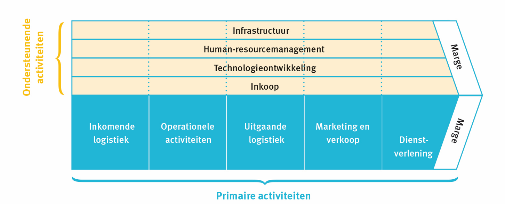
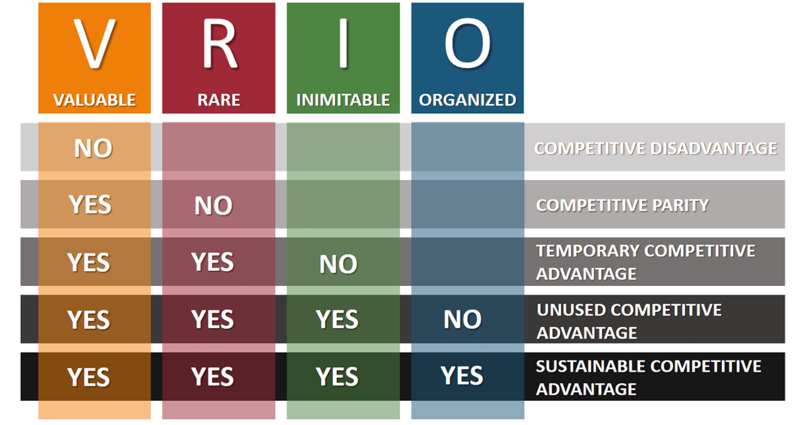
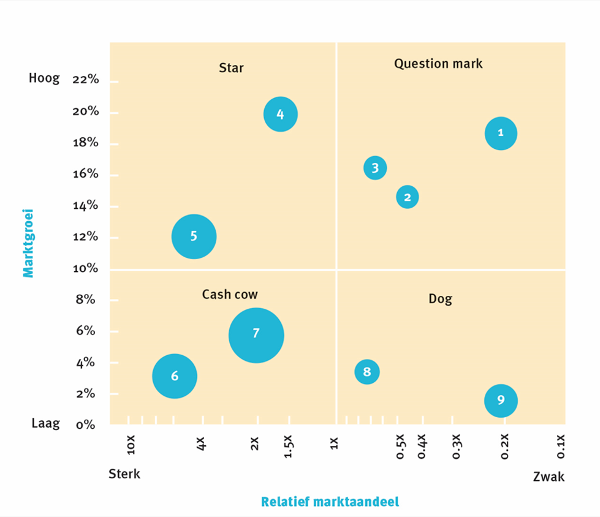

# Deel: 4 Analyse van de organisatie <!-- omit in toc -->

- [Interne omgeving](#interne-omgeving)
  - [Sterkten](#sterkten)
  - [Zwakten](#zwakten)
  - [Sterkte of zwakte](#sterkte-of-zwakte)
  - [Benchmarking](#benchmarking)
  - [Aandacht voor MVO](#aandacht-voor-mvo)
- [Waardeketen van Porter](#waardeketen-van-porter)
  - [Primaire activiteiten](#primaire-activiteiten)
  - [Ondersteunende activiteiten](#ondersteunende-activiteiten)
  - [Marge](#marge)
- [VRIO-model](#vrio-model)
- [BCG-matrix](#bcg-matrix)
  - [Strategische interpretatie](#strategische-interpretatie)

---

## Interne omgeving

De interne omgeving bestaat uit de **middelen en capaciteiten** van een organisatie. De analyse hiervan geeft inzicht in de sterkten en zwakten van een organisatie.

- De middelen zijn haar bezittingen
- De capaciteiten van een organisatie zijn vaardigheden en het vermogen om de nodige activiteiten te ontplooien.

### Sterkten

Interne componenten met eventuele gunstige invloed op de realisatie van doelstellingen. De interne componenten kunnen een troef zijn wanneer ze de realisatie van doelstellingen: **ondersteunen of versnellen**.

### Zwakten

Interne componenten met eventuele ongunstige invloed op de realisatie van doelstellingen. De interne componenten vormen een rem wanneer ze de realisatie van doelstellingen **vertragen of tegenwerken**.

### Sterkte of zwakte

De mate waarin een intern component als sterkte of zwakte wordt beoordeeld is onder andere afhankelijk van:

- De gekozen strategie van de organisatie
- De markt waarop men actief is: gedrag van klanten en concurrenten
- De wijze waarop er op externe situaties wordt gereageerd.
- **De gekozen strategie duurzaam is**

### Benchmarking

**Het doel van benchmarking** (een maatstaf / referentiepunt stellen) het bestuderen van bedrijfsprocessen bij andere organisaties om verbeterpunten voor de eigen competenties op te sporen.

Kennis van de externe omgeving is mee bepalend om een sterkte te creeren of zwakte te identificeren.

**Volstaan de huidige middelen** en capaciteiten om de concurrentie te verslaan?
**Wat kan er geleerd worden** van andere bedrijven?

### Aandacht voor MVO

*Volgens onderzoek is duurzaamheid voor de afnemer steeds belangrijker.* Organisaties die te weinig investeren in MVO dreigen op termijn klanten te verliezen.

---

## Waardeketen van Porter

De waardeketen is een bedrijfskundig concept dat de strategisch relevante activiteiten van een organisatie met elkaar in verband brengt.

Dit model wordt ook gebruikt om de interacties met stakeholders systematisch te onderzoeken.
De waarde keten bevat **primaire activiteiten** en **secundaire of ondersteunende activiteiten**.

### Primaire activiteiten

De activiteiten die rechtstreeks waarde toevogen aan het product van de organisatie:

- Ontvangst & opslag
- Productie
- Fysieke distributie
- Marketing en verkoop
- Dienstverlening

### Ondersteunende activiteiten

De activiteiten die ervoor zorgen dat de primaire activiteiten mogelijk worden gemaakt:

- Inkoopmanagement
- Technologie & ontwikkeling
- Personeel & organisatie (HRM)
- Infrastructuur

### Marge

De marge is het verschil tussen de totale kosten van alle primaire en ondersteunende activiteiten en de totale opbrengsten van de organisatie.

---

## VRIO-model

Het VRIO-model help de onderneming om de middelen te identificeren. Ondernemingen die concurrentievoordeel opleveren of zwak scoren.

Middelen kunnen een duurzaam concurrentievoordeel opleveren als ze:

- Waardevol
- Zeldzaam
- Moeilijk te imiteren zijn
- De middelen kunne worden ingezet voor waardecreatie

---

## BCG-matrix

Het BCG-matrix is een portfolie dat een overzicht geeft van alle producten die een bedrijf op dit ogenblik op de markt aanbiedt. De matrix wordt gebruikt om na te gaan welke (strategische) acties de onderneming moet ondernemen.

**X-as:**
$$
    relatief markt aandee = \frac{Eigen marktaandeel}{Marktaandeel van de grootste concurrent}
$$
**Y-as**: groeitempo van de markt

### Strategische interpretatie

Een strategisch gezonde organisatie zal streven naar een **evenwichtige portefeulle** van producten. Door middel van plannisseninstrumenten en cashflow.

Zo kan cashflow gebruikt worden voor Reseasrch and Development.
