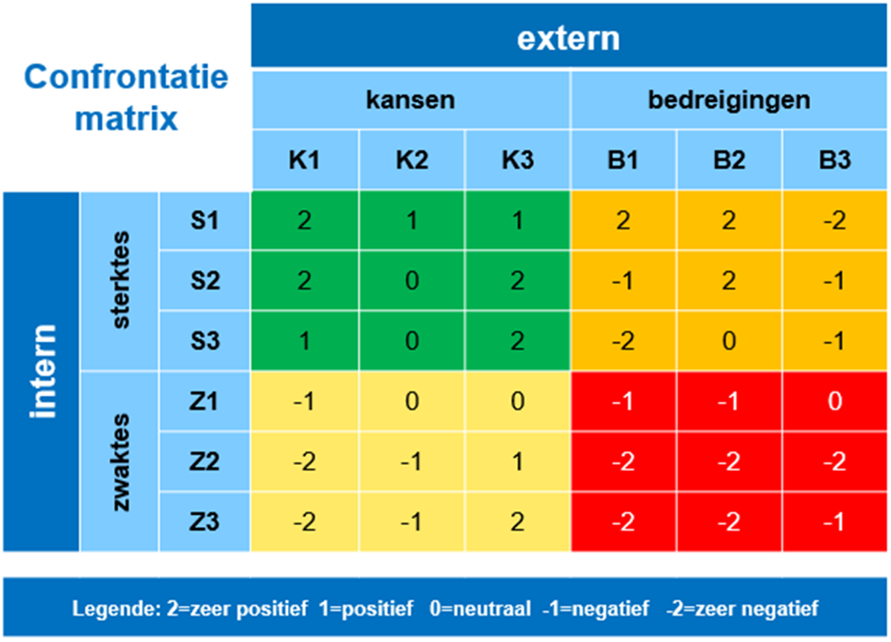
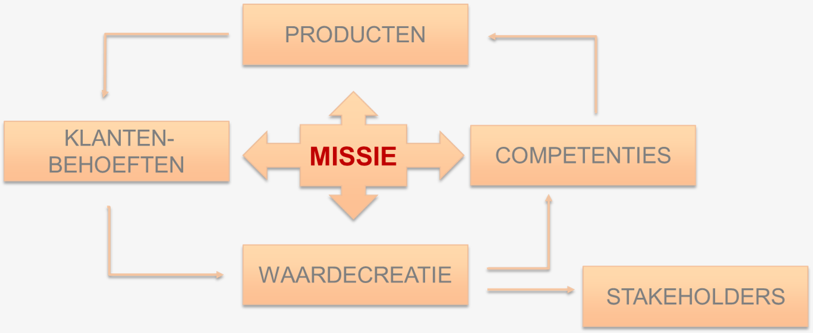
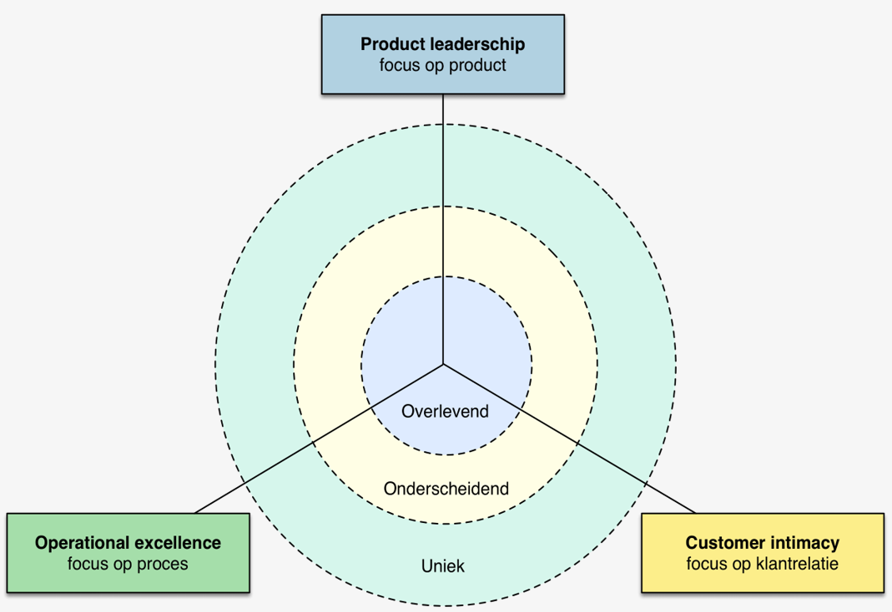

# SWOT-analyse <!-- omit in toc -->

- [SWOT-analyse](#swot-analyse)
- [Confrontatiematrix](#confrontatiematrix)
  - [Werkwijze](#werkwijze)
  - [Interpretatie van de kruispunten](#interpretatie-van-de-kruispunten)
- [Missie als leidraad](#missie-als-leidraad)
  - [Omschrijving](#omschrijving)
  - [Kenmerken van een goede missie](#kenmerken-van-een-goede-missie)
  - [De missie stuurt de strategie](#de-missie-stuurt-de-strategie)
- [Strategische keuzes](#strategische-keuzes)
  - [Doelen en doelstellingen](#doelen-en-doelstellingen)
  - [Groeistrategieën van Ansoff](#groeistrategieën-van-ansoff)
  - [Waardestrategieën van Treacy & Wiersema](#waardestrategieën-van-treacy--wiersema)
- [Strategie evalueren](#strategie-evalueren)

## SWOT-analyse

- **Strengths**
- **Weaknesses**
- **Opportunities**
- **Threats**

Doel van de SWOT-analyse:

Onderbouwing voor de strategiekeuze: ```Hoe gaan we de continuïteit realiseren?```

Beter inspelen op een dynamische externe omgeving: ```Inzicht in de huidige situatie helpt flexibele besluitvorming.```

---

## Confrontatiematrix

De confrontatiematrix is het vervolg van de SWOT-analyse:

- De matrix laat zien hoe de organisatie aansluit op de externe omgeving.
- Sterktes en zwaktes worden afgetoetst tegenover kansen en bedreigingen.

Het doel is om een nieuwe strategie te ontwikkelen om de continuïteit veilig te stellen.

### Werkwijze

1. Selecteer de **3 belangrijkste** sterkten, zwakten, kansen en bedreigingen.
2. Koppel in de matrix de sterkten en zwakten aan de kansen en bedreigingen.
3. Confronteer een factor uit de externe omgeving met een factor uit de interne omgeving.


X-as: Externe factoren
Y-as: Interne factoren

### Interpretatie van de kruispunten

1. Elk vakje of kruispunt in de matrix beoordeelt de relatie tussen 2 factoren uit de SWOT.
2. Daarna selecteer je enkele kruispunten die een hoog strategisch belang hebben:

---

## Missie als leidraad

### Omschrijving

Een missie:

- Geeft de organisatie een **opdracht**
- Omschrijft de **bestaansreden**
- Benoemt de **kernwaarden**
- **Stuurt** de continuïteitskring
- **Bakent** de activiteiten af. Wat we wel en zeker niet doen
- Zorgt ervoor dat **belanghebbenden** bereid zijn om **mee te werken** aan 'het project' van de onderneming
- Helpt een **gemeenschappelijke identiteit** uit te dagen

### Kenmerken van een goede missie

- **Markt georiënteerd:** De klant staat centraal
- **Inspirerend:** Ik word er warm van
- **Summier:** Kort en krachtig
- **Specifiek:** Tastbaar, concreet
- **Ijverig:** Zet aan tot actie
- **Omstreden:** Voer voor discussie
- **Nalatenschap:** Voor een betere toekomst

### De missie stuurt de strategie

Een missie heeft betrekking op de hele onderneming.
Een missie schept duidelijkheid voor medewerkers en andere stakeholders over wat de organisatie doet en wat ze zeker niet doet.



---

## Strategische keuzes

### Doelen en doelstellingen

**Doel:** Een kwalitatieve omschrijving een beoogd resultaat.
**Doelstelling:** Een kwantitatieve omschrijving een beoogd resultaat.

**S**pecifiek
**M**eetbaar
**A**anvaardbaar
**R**ealistisch
**T**ijdskader

### Groeistrategieën van Ansoff

Een succesvol bedrijf is altijd op zoek naar nieuwe manieren om omzet en winst te verhogen door nieuwe klanten te werven. Welke mogelijkheden zijn het beste geschikt?
De groeistrategieën van de Ansoff-matrix helpen hierbij.

| Producten Markten | Bestaande markten | Nieuwe markten |
| :--- | ---: | ---: |
| **Bestaande producten** | Marktpenetratie | Marktontwikkeling |
| **Nieuwe producten** | Productontwikkeling | Diversificatie |

- **Marktpenetratie:** Het vergroten van het huidige marktaandeel
- **Marktontwikkeling:** Het leerproces voor de organisatie
- **Productontwikkeling:** Nieuwe producten (nieuw voor het bedrijf) aan bestaande klanten verkopen.
- **Diversificatie:** 
  - Verwante diversificatie: In lijn van het reeds bestaande assortiment.
  - Niet-verwante diversificatie: De nieuwe producten verschillen in grote mate van de huidige business.

### Waardestrategieën van Treacy & Wiersema

- **Operational Excellence:**
  - Voldoende kwaliteit tegen redelijke prijzen
  - Koopgemak of convenience primeert
- **Product leadership:**
  - De beste, innovatieve producten aanbieden
  - R&D is essentieel
  - Topkwaliteit nastreven
- **Customer Intimacy:**
  - Maatwerk
  - Aanbod voor individuele klant
  - Persoonlijk advies
- **Marktconform of concurrentievoordeel:**



---

## Strategie evalueren

Is de huidige strategie nog werkbaar?
Zijn er uit de confrontatiematrix nieuwe strategische aandachtspunten voortgekomen?
Zijn er andere strategische mogelijkheden?

De huidige of nieuwe strategie wordt aan de hand van verschillende criteria beoordeeld.

1. Suitability: Kunnen we onze doelen en doelstellingen realiseren?
2. Feasibility: Heeft de onderneming de middelen om de strategie te implementeren?
3. Acceptability: Wordt de strategie door alle belangengroepen gedragen?
4. MVO: Elke activiteit van de organisatie voldoet aan Triple bottom line.
