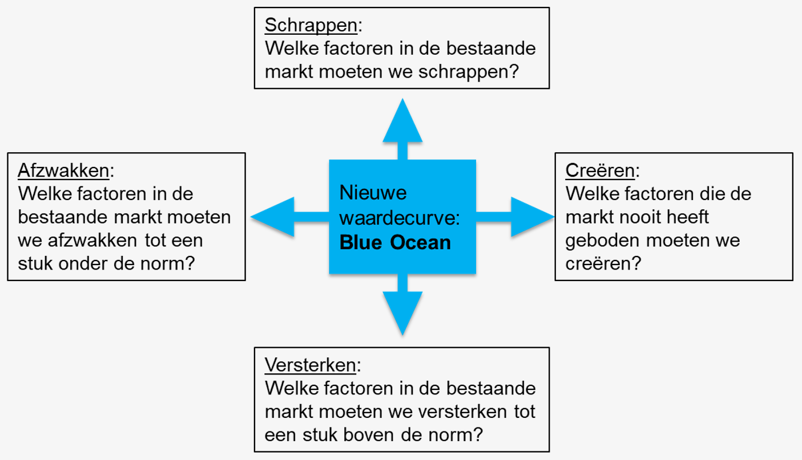
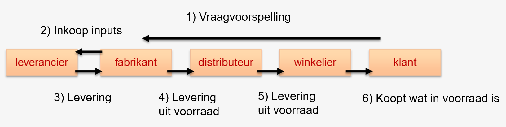
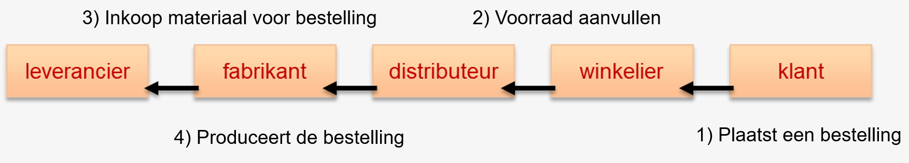
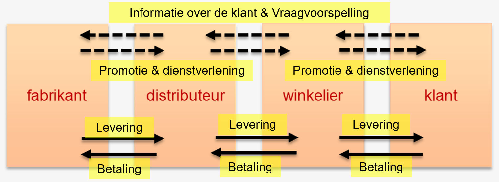
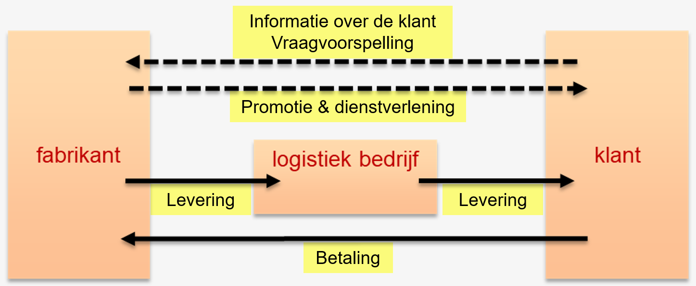

# Deel 6: Waardeaanbod bepalen <!-- omit in toc -->

- [Inleiding](#inleiding)
- [Blue Oceanstrategie](#blue-oceanstrategie)
  - [Kenmerken Red Ocean](#kenmerken-red-ocean)
  - [Kenmerken Blue Ocean](#kenmerken-blue-ocean)
- [Strategische bedrijfsprocessen](#strategische-bedrijfsprocessen)
  - [Operationele activiteiten](#operationele-activiteiten)
  - [Uitgaande logistiek](#uitgaande-logistiek)
- [Besluit](#besluit)

---

## Inleiding

Doel: Behoeftebevrediging aanbieden en de concurrentie overtreffen.
De gekozen strategie:

**Business:** Bestaande producten ondersteunen of nieuwe producten ontwikkelen om in de behoeften van de klanten te blijven voorzien.
**Management:** Allerhande activiteiten plannen, coördineren & controleren.

Het is essentieel om het verschil te kunnen maken t.o.v. de concurrentie is het creëren van unieke klantenwaarde.

---

## Blue Oceanstrategie

**Red Ocean:** Een situatie waar naarmate de concurrentie op de markt toeneemt de winstkansen afnemen, en geeft aan dat de markt te onaantrekkelijk is geworden.

### Kenmerken Red Ocean

- Concurreer in bestaande markten
- Versla de concurrentie
- Exploiteer bestaande vraag
- Maak de afweging tussen waarde en kosten
- Stem de activiteiten af op de strategische keuze tussen differentiatie en lage kosten

In het geval van een '*Red Ocean*', is het tijd om een nieuwe markt te creëren: de '*Blue Ocean*'

### Kenmerken Blue Ocean

- Creëer een nieuwe markt
- Maak dat de concurrentie er niet toe doet
- Creëer en bedien nieuwe vraag
- Doorbreek de afweging tussen waarde en kosten
- Stem de activiteiten af op het nastreven van differentiatie en lage kosten

Let Op!

- Blue Ocean zijn ook voor klanten vaak ook nieuw: Zien ze de behoeftebevrediging als een meerwaarde?
- Blue Ocean geven als gevolg van de onbekendheid ook meer onzekerheid

---

## Strategische bedrijfsprocessen

- Voldoende behoeftebevrediging aanbieden
- Een aantrekkelijk product heeft unieke kenmerken
- Goede afstemming tussen de verschillende bedrijfsprocessen
- Activiteiten bijsturen:
  - Evenwicht zoeken tussen lage kostprijs voor productie en voorraadbeheer
  - Betrouwbare leveringsgraad handhaven

### Operationele activiteiten

- Duivelsdriehoek:
  - Hoge leveringsgraad
  - Lange Productie runs:
  - Lage voorraden
- Just-in-time of JIT: Er is nauwelijks voorraad nodig binnen het bedrijf. Hierdoor zijn de voorraad kosten laag. Hoog onderling vertrouwen nodig met leverancier.
- Productieplanning: Helpt in het zoeken naar een evenwicht tussen een hoge leveringsgraad behalen en de kosten die erbij horen.
  - **Model 1:** Produceren op voorraad (make to stock) valt tussen lange productie runs en hoge leveringsgraad.
  
  - **Model 2:** Produceren op bestelling (make to order) valt tussen lage voorraden hoge leveringsgraad.
  

### Uitgaande logistiek

Bij de uitgaande logiesgiek gaat de aandacht naar drie soorten activiteiten:

1. Kennis over de klanten samenbrengen om  het aanbod hierop af te stemmen.
2. Distributie van producten en het administratief afhandelen van de betaling.
3. Klanten overtuigen door communicatieactiviteiten en dienstverlening.

- **Klassiek distributiemodel:**

- **Nieuw distributiemodel:**

---

## Besluit

Deze bedrijfsprocessen zijn voorbeelden van keuzes die het management voortdurend moet maken om de continuïteit van de organisatie te verzekeren.
Het spreekt voor zich dat er in de waardeketen veel soorten activiteiten zijn die moeten worden gepland.
