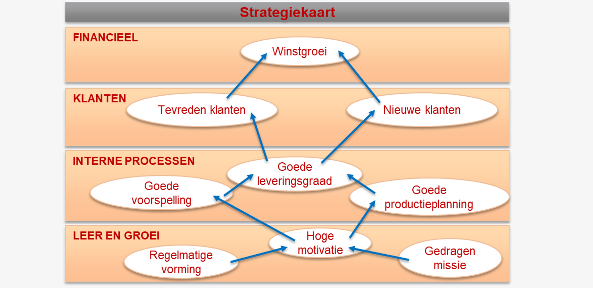
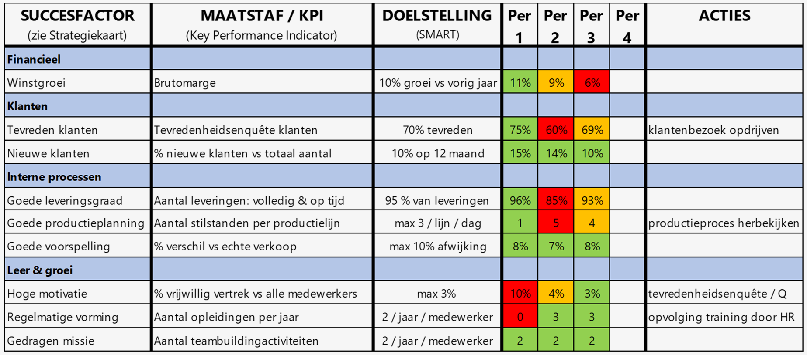

# Part7: Omgeving <!-- omit in toc -->

- [De gekozen strategie realiseren](#de-gekozen-strategie-realiseren)
- [Strategiekaart](#strategiekaart)
- [Balanced scorecard](#balanced-scorecard)

---

## De gekozen strategie realiseren

Een strategie is de gekozen koers van de organisatie om haar missie te verwezenlijken
Het management moet voortdurend activiteiten plannen, coördineren & controleren. Hiervoor wordt de **PDCA-cyclus** gebruikt.

- **Plan:** Activiteiten opstellen en coördineren
- **Do:** Het plan uitvoeren
- **Check:** Nagaan of alles volgens plan is verlopen: Worden de doelstellingen gehaald?
- **Act:** Waar en hoe moet het plan worden bijgestuurd?

---

## Strategiekaart

Een strategiekaart is een instrument dat helpt de strategie te vertalen naar activiteiten. Het is dus een hulpmiddel bij het analyseren van belangrijke informatie.

Binnen de strategiekaart stuwt elke onderlinge afhankelijkheid de andere vooruit.

Indicatoren binnen de Strategiekaart:

- **Lagging indicatoren** (*Financieel*): bevatten informatie over het verleden
- **Leading indicatoren** (*Klanten, Interne processen, Leer en groei*): bevatten informatie over een waarschijnlijke toekomst.

---

## Balanced scorecard

Om de volledige PDCA-cyclus af te werken volstaat de strategiekaart niet. De strategiekaart is het vertrekpunt voor een zeer belangrijk managementinstrument: **de balanced scorecard**

Bij het begin van het jaar worden een aantal doelstellingen vastgelegd:

- Hoeveel winst wil de organisatie volgend jaar?
- Hoe tevreden moeten de klanten zijn?
- Wat is een goed draaiend proces?
- Wat zijn goede medewerkers?

**Ten laatste** wordt de act kolom toe gevoegd.

